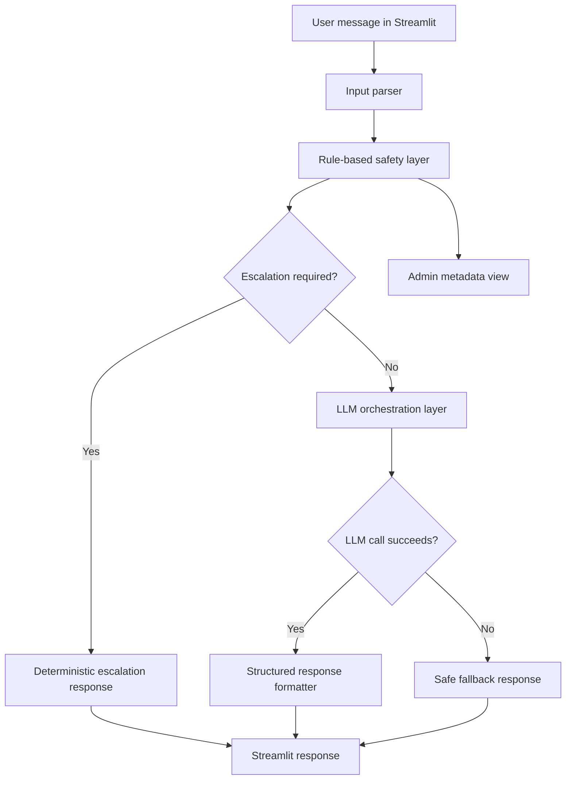

# Maseru Health AI

Maseru Health AI is an operational AI assistant designed for healthcare support workflows in low-resource environments.

Live app: [https://maseru-health-support-ai.streamlit.app/](https://maseru-health-support-ai.streamlit.app/)

## Overview

Maseru Health AI is a Streamlit-based, non-diagnostic healthcare support assistant focused on safe conversational guidance, lightweight input parsing, rule-based safety escalation, and LLM-assisted response generation.

The project is built as an AI systems engineering portfolio project: it separates the user interface, parsing, safety rules, LLM orchestration, and response formatting into clear Python modules. The system is intentionally conservative. It does not provide diagnosis, treatment, clinical advice, emergency response, or claims of clinical validation.

## What the System Does

- Accepts user messages through a Streamlit chat interface.
- Parses the message into a coarse intent and simple support signals.
- Runs safety checks before calling the LLM.
- Uses rule-based escalation for high-risk language and serious physical red flags.
- Uses the existing Google ADK + LiteLLM provider with `gpt-4o-mini` by default.
- Returns structured internal responses and renders user-facing guidance with professional-help guidance.
- Falls back to a safe deterministic response if the LLM is unavailable or fails.
- Provides a small admin view for inspecting parser and safety metadata.

## What the System Does NOT Do

- It does not diagnose medical or mental health conditions.
- It does not prescribe medication or treatment.
- It does not replace a clinician, counselor, clinic, hospital, or emergency service.
- It does not provide emergency response capability.
- It does not claim clinical validation or production readiness.
- It does not use retrieval-augmented generation.
- It does not store patient records or provide authenticated clinical workflows.

## Architecture

The app follows a simple modular workflow:

- `app/streamlit_app.py`: Streamlit user interface.
- `app/triage_service.py`: application service that coordinates the workflow.
- `app/parser.py`: lightweight intent and signal extraction.
- `app/rules.py`: rule-based safety layer built around the existing risk classifier.
- `app/llm.py`: Google ADK + LiteLLM orchestration.
- `app/response_formatter.py`: structured response generation.
- `app/config.py`: environment and runtime configuration.
- `src/paths.py`: shared repository-root-aware filesystem paths.
- `src/`: existing preprocessing, TF-IDF, classifier, and decision-engine utilities.
- `tests/`: standard-library tests for parser, safety, escalation, and fallback behavior.

## Mermaid Architecture Diagram



## Operational Workflow

1. The user enters a message in the Streamlit chat interface.
2. The parser extracts a coarse intent such as `greeting`, `emotional_support`, `health_support`, or `general_support`.
3. The safety layer evaluates the message using deterministic rules and the existing TF-IDF + Logistic Regression risk classifier.
4. If high-risk language or physical red flags are detected, the system returns escalation messaging without calling the LLM.
5. If escalation is not required, the LLM layer generates supportive, non-diagnostic guidance.
6. The response formatter keeps a consistent internal structure:
   - Summary
   - Guidance
   - When to seek professional help
   - Limitations
7. The Streamlit chat renders guidance and professional-help guidance, while limitations are shown as a small app-level disclaimer.
8. If the LLM fails or the API key is missing, the system returns a safe fallback response.

## Key Features

- Modular AI workflow design.
- Streamlit user interface and admin safety-inspection page.
- Pre-LLM safety checks.
- Deterministic escalation path for high-risk messages.
- LLM orchestration through Google ADK + LiteLLM.
- Environment-variable handling for API keys.
- Structured response formatting.
- Graceful fallback behavior when the LLM is unavailable.
- Repository-root-aware model and dataset paths for local and Streamlit Cloud runs.

## Design Decisions

- The safety layer runs before the LLM to reduce reliance on generative behavior for high-risk messages.
- High-risk responses are deterministic rather than model-generated.
- The LLM is used only for supportive, general guidance after safety checks pass.
- The response structure is generated by application code so the UI remains consistent even when the LLM response varies.
- The existing classifier and model artifacts are preserved to keep the project simple and runnable.
- API keys are loaded from environment variables rather than hardcoded in the repository.

## Tech Stack

- Python
- Streamlit
- Google ADK
- LiteLLM
- OpenAI-compatible model configuration through `OPENAI_API_KEY`
- scikit-learn
- pandas
- TF-IDF
- Logistic Regression
- python-dotenv

## Repository Structure

```text
.
+-- app/
|   +-- __init__.py
|   +-- config.py
|   +-- llm.py
|   +-- parser.py
|   +-- response_formatter.py
|   +-- rules.py
|   +-- streamlit_admin_app.py
|   +-- streamlit_app.py
|   +-- triage_service.py
+-- data/
|   +-- generate_dataset.py
|   +-- mental_health_dataset.csv
+-- models/
|   +-- model.pkl
|   +-- vectorizer.pkl
+-- src/
|   +-- __init__.py
|   +-- classifier.py
|   +-- decision_engine.py
|   +-- feature_engineering.py
|   +-- paths.py
|   +-- preprocessing.py
|   +-- rules.py
+-- tests/
|   +-- __init__.py
|   +-- test_safety_workflow.py
+-- .gitignore
+-- application.py
+-- LICENSE
+-- requirements.txt
+-- README.md
```

## Setup Instructions

Create and activate a virtual environment:

```powershell
python -m venv .venv
.\.venv\Scripts\Activate.ps1
```

Install dependencies:

```powershell
pip install -r requirements.txt
```

## Environment Variables

The LLM layer uses LiteLLM with `gpt-4o-mini` by default. Configure the API key through an environment variable:

```powershell
setx OPENAI_API_KEY "your_api_key_here"
```

Optional variables:

```powershell
setx MASERU_LLM_MODEL "gpt-4o-mini"
setx MASERU_APP_NAME "maseru_health_support"
```

After using `setx`, restart the terminal before running the app.

You can also create a local `.env` file:

```text
OPENAI_API_KEY=your_api_key_here
MASERU_LLM_MODEL=gpt-4o-mini
MASERU_APP_NAME=maseru_health_support
```

Do not commit `.env` files or API keys.

## How to Run Locally

Main user app:

```powershell
streamlit run application.py --server.port 8501
```

Equivalent structured entry point:

```powershell
streamlit run app/streamlit_app.py --server.port 8501
```

Admin safety-inspection app:

```powershell
streamlit run app/streamlit_admin_app.py --server.port 8502
```

Regenerate the demonstration dataset:

```powershell
python data/generate_dataset.py
```

Retrain the demonstration risk classifier:

```powershell
python -m src.classifier
```

Run the deterministic safety workflow tests:

```powershell
python -m unittest discover
```

## Deployment Notes

The deployed Streamlit app is available here:

[https://maseru-health-support-ai.streamlit.app/](https://maseru-health-support-ai.streamlit.app/)

For Streamlit Cloud, use `application.py` as the main file.

Configure these as root-level Streamlit Cloud secrets:

```text
OPENAI_API_KEY = "your_api_key_here"
MASERU_LLM_MODEL = "gpt-4o-mini"
MASERU_APP_NAME = "maseru_health_support"
```

The app also supports this nested OpenAI secret format:

```text
[openai]
api_key = "your_api_key_here"
```

The app can still render safe fallback responses without `OPENAI_API_KEY`, but LLM-assisted guidance will not run.

## Current Limitations

- The classifier uses a small demonstration dataset and should not be treated as clinically reliable.
- Safety rules are intentionally simple and need broader review for real-world deployment.
- The app does not persist conversations, users, or risk assessments.
- There is no authentication or role-based access control for the admin page.
- The app has not been clinically validated.
- The system is not production-ready and should not be used as a medical device.
- Sesotho support is limited and depends mainly on the selected response language and LLM behavior.

## Roadmap

- Expand test coverage for UI launch behavior and LLM orchestration failures.
- Expand the safety rule set with expert-reviewed language and local care guidance.
- Add calibrated evaluation for the demonstration classifier.
- Add session persistence with explicit privacy controls.
- Add admin authentication before exposing safety metadata in any deployed setting.
- Improve bilingual response quality with reviewed Sesotho content.
- Add structured logging for development and debugging without storing sensitive user data by default.

## Portfolio Positioning

This project demonstrates AI systems engineering skills beyond a basic chatbot demo:

- Designing a modular AI workflow around a Streamlit product surface.
- Separating deterministic safety checks from generative model behavior.
- Orchestrating LLM calls behind a service layer.
- Handling API-key configuration through environment variables.
- Generating structured, safety-bounded responses.
- Preserving transparent limitations in a sensitive healthcare-adjacent context.
- Building deployment-aware code paths that can run locally or on Streamlit Cloud.

The project is best understood as an applied AI engineering prototype for healthcare support workflows in low-resource environments, not as a clinical product.
